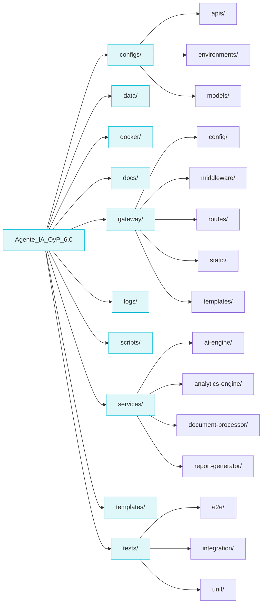
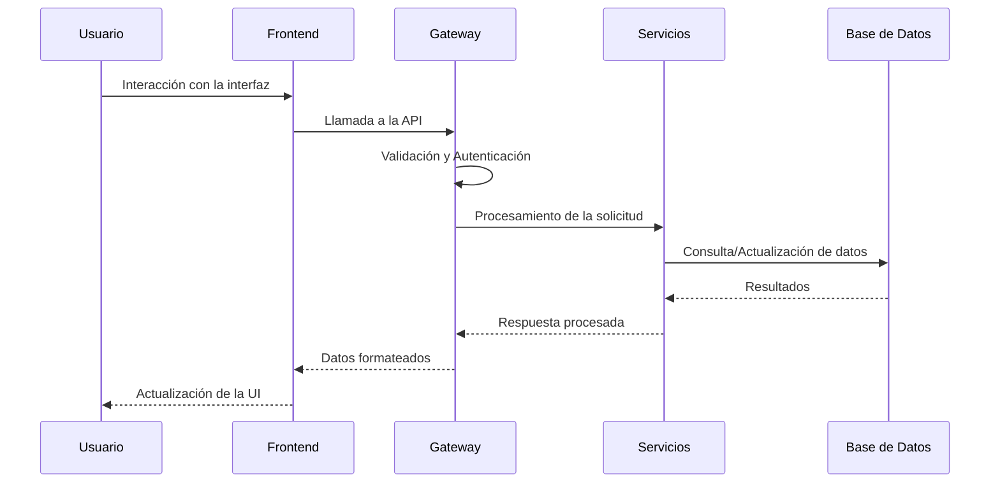

# Diagrama de Estructura del Proyecto

```mermaid
graph TD
    A[Agente IA OyP 6.0] --> B[Gateway]
    A --> C[Servicios]
    A --> D[Data]
    A --> E[Configuración]
    A --> F[Documentación]
    A --> G[Pruebas]
    
    B --> B1[API REST/WebSocket]
    B --> B2[Autenticación]
    B --> B3[Middleware]
    B --> B4[Frontend]
    
    C --> C1[AI Engine]
    C --> C2[Analytics Engine]
    C --> C3[Document Processor]
    C --> C4[Report Generator]
    
    D --> D1[Backups]
    D --> D2[Cache]
    D --> D3[Modelos]
    D --> D4[Uploads]
    
    E --> E1[APIs]
    E --> E2[Entornos]
    E --> E3[Modelos]
    
    F --> F1[API Docs]
    F --> F2[Guías]
    F --> F3[Despliegue]
    
    G --> G1[Unitarias]
    G --> G2[Integración]
    G --> G3[E2E]

    %% Estilos
    classDef root fill:#2ecc71,stroke:#27ae60,color:white,font-weight:bold
    classDef component fill:#3498db,stroke:#2980b9,color:white
    classDef service fill:#9b59b6,stroke:#8e44ad,color:white
    classDef data fill:#e74c3c,stroke:#c0392b,color:white
    classDef config fill:#f39c12,stroke:#d35400,color:white
    classDef docs fill:#1abc9c,stroke:#16a085,color:white
    classDef tests fill:#e67e22,stroke:#d35400,color:white
    
    class A root
    class B,C,D,E,F,G component
    class C1,C2,C3,C4 service
    class D1,D2,D3,D4 data
    class E1,E2,E3 config
    class F1,F2,F3 docs
    class G1,G2,G3 tests
```



## Cómo visualizar el diagrama

1. Copia el código del diagrama Mermaid (entre los ```mermaid)
2. Visita [Mermaid Live Editor](https://mermaid.live/)
3. Pega el código en el editor
4. El diagrama se generará automáticamente

## Alternativas para visualización

1. **Extensiones de VS Code**:
   - Mermaid Preview
   - Mermaid Markdown Syntax Highlighting
   - Mermaid Editor

2. **Otras herramientas**:
   - GitLab/GitHub soportan Mermaid en sus archivos .md
   - Mermaid CLI para generación de imágenes
   - Plugins para editores de texto

## Estructura detallada de directorios



## Flujo de la Aplicación


